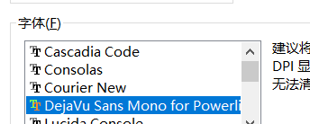

# PowerShell

## 美化 PowerShell

美化效果:


### 配置windows允许执行没有签名（远程）的Powershell脚本

在设置中面板中搜索PowerShell 找到开发人员设置,打勾这一项


### 下载Windows包管理工具

```powershell
Set-ExecutionPolicy Bypass -Scope Process -Force; iex ((New-Object System.Net.WebClient).DownloadString('https://chocolatey.org/install.ps1'))
```

输入 `choco -v`验证是否安装成功

### GIT

```powershell
choco install git
```

### 字体库

只需要安装字体库中 [DejaVuSansMono](https://github.com/powerline/fonts/tree/master/DejaVuSansMono) 的字体就可以了. 字体下载好右键安装即可.

### powershell的git集成方案 posh-git

```powershell
Install-Module posh-git
```

### 基于posh-git的美化主题oh-my-posh

```powershell
Install-Module oh-my-posh
```

### 硬货在这里

刚刚前面做的全都是事前准备而已，这里才是真正影响Powershell主题的主要关键。直接复制到Powershell跑一下吧。

```powershell
Install-Module -Name PSReadLine -Force -SkipPublisherCheck
if (!(Test-Path -Path $PROFILE )) { New-Item -Type File -Path $PROFILE -Force }
@"
#requires -Version 2 -Modules posh-git

function Write-Theme {
    param(
        [bool]
        `$lastCommandFailed,
        [string]
        `$with
    )

    `$lastColor = `$sl.Colors.PromptBackgroundColor
    `$prompt = Write-Prompt -Object `$sl.PromptSymbols.StartSymbol -ForegroundColor `$sl.Colors.PromptForegroundColor -BackgroundColor `$sl.Colors.SessionInfoBackgroundColor

    #check the last command state and indicate if failed
    If (`$lastCommandFailed) {
        `$prompt += Write-Prompt -Object "`$(`$sl.PromptSymbols.FailedCommandSymbol) " -ForegroundColor `$sl.Colors.CommandFailedIconForegroundColor -BackgroundColor `$sl.Colors.SessionInfoBackgroundColor
    }

    #check for elevated prompt
    If (Test-Administrator) {
        `$prompt += Write-Prompt -Object "`$(`$sl.PromptSymbols.ElevatedSymbol) " -ForegroundColor `$sl.Colors.AdminIconForegroundColor -BackgroundColor `$sl.Colors.SessionInfoBackgroundColor
    }

    `$user = [System.Environment]::UserName
    `$computer = [System.Environment]::MachineName
    `$path = Get-FullPath -dir `$pwd
    if (Test-NotDefaultUser(`$user)) {
        `$prompt += Write-Prompt -Object "`$user@`$computer " -ForegroundColor `$sl.Colors.SessionInfoForegroundColor -BackgroundColor `$sl.Colors.SessionInfoBackgroundColor
    }

    if (Test-VirtualEnv) {
        `$prompt += Write-Prompt -Object "`$(`$sl.PromptSymbols.SegmentForwardSymbol) " -ForegroundColor `$sl.Colors.SessionInfoBackgroundColor -BackgroundColor `$sl.Colors.VirtualEnvBackgroundColor
        `$prompt += Write-Prompt -Object "`$(`$sl.PromptSymbols.VirtualEnvSymbol) `$(Get-VirtualEnvName) " -ForegroundColor `$sl.Colors.VirtualEnvForegroundColor -BackgroundColor `$sl.Colors.VirtualEnvBackgroundColor
        `$prompt += Write-Prompt -Object "`$(`$sl.PromptSymbols.SegmentForwardSymbol) " -ForegroundColor `$sl.Colors.VirtualEnvBackgroundColor -BackgroundColor `$sl.Colors.PromptBackgroundColor
    }
    else {
        `$prompt += Write-Prompt -Object "`$(`$sl.PromptSymbols.SegmentForwardSymbol) " -ForegroundColor `$sl.Colors.SessionInfoBackgroundColor -BackgroundColor `$sl.Colors.PromptBackgroundColor
    }

    # Writes the drive portion
    `$prompt += Write-Prompt -Object "`$path " -ForegroundColor `$sl.Colors.PromptForegroundColor -BackgroundColor `$sl.Colors.PromptBackgroundColor

    `$status = Get-VCSStatus
    if (`$status) {
        `$themeInfo = Get-VcsInfo -status (`$status)
        `$lastColor = `$themeInfo.BackgroundColor
        `$prompt += Write-Prompt -Object `$(`$sl.PromptSymbols.SegmentForwardSymbol) -ForegroundColor `$sl.Colors.PromptBackgroundColor -BackgroundColor `$lastColor
        `$prompt += Write-Prompt -Object " `$(`$themeInfo.VcInfo) " -BackgroundColor `$lastColor -ForegroundColor `$sl.Colors.GitForegroundColor
    }

    # Writes the postfix to the prompt
    `$prompt += Write-Prompt -Object `$sl.PromptSymbols.SegmentForwardSymbol -ForegroundColor `$lastColor

    `$timeStamp = Get-Date -UFormat %r
    `$timestamp = "[`$timeStamp]"

    `$prompt += Set-CursorForRightBlockWrite -textLength (`$timestamp.Length + 1)
    `$prompt += Write-Prompt `$timeStamp -ForegroundColor `$sl.Colors.PromptForegroundColor

    `$prompt += Set-Newline

    if (`$with) {
        `$prompt += Write-Prompt -Object "`$(`$with.ToUpper()) " -BackgroundColor `$sl.Colors.WithBackgroundColor -ForegroundColor `$sl.Colors.WithForegroundColor
    }
    `$prompt += Write-Prompt -Object (`$sl.PromptSymbols.PromptIndicator) -ForegroundColor `$sl.Colors.PromptBackgroundColor
    `$prompt += ' '
    `$prompt
}

`$sl = `$global:ThemeSettings #local settings
`$sl.PromptSymbols.StartSymbol = ''
`$sl.PromptSymbols.PromptIndicator = [char]::ConvertFromUtf32(0x276F)
`$sl.PromptSymbols.SegmentForwardSymbol = [char]::ConvertFromUtf32(0xE0B0)
`$sl.Colors.PromptForegroundColor = [ConsoleColor]::White
`$sl.Colors.PromptSymbolColor = [ConsoleColor]::White
`$sl.Colors.PromptHighlightColor = [ConsoleColor]::DarkBlue
`$sl.Colors.GitForegroundColor = [ConsoleColor]::Black
`$sl.Colors.WithForegroundColor = [ConsoleColor]::DarkRed
`$sl.Colors.WithBackgroundColor = [ConsoleColor]::Magenta
`$sl.Colors.VirtualEnvBackgroundColor = [System.ConsoleColor]::Red
`$sl.Colors.VirtualEnvForegroundColor = [System.ConsoleColor]::White
"@>$env:userprofile"\Documents\WindowsPowerShell\Modules\oh-my-posh\2.0.230\Themes\Paradox.psm1"
@"
chcp 65001
Set-PSReadlineOption -EditMode Emacs
function which(`$name) { Get-Command `$name | Select-Object Definition }
function rmrf(`$item) { Remove-Item `$item -Recurse -Force }
function mkfile(`$file) { "" | Out-File `$file -Encoding ASCII }
Import-Module posh-git
Import-Module oh-my-posh
Set-Theme Paradox
"@ > $PROFILE
chcp 65001
Set-PSReadlineOption -EditMode Emacs
Import-Module posh-git
Import-Module oh-my-posh
Set-Theme Paradox

```

设置powershell字体,选择安装的powerline字体.



其他主题参考 [主题页面](https://github.com/JanDeDobbeleer/oh-my-posh#themes)