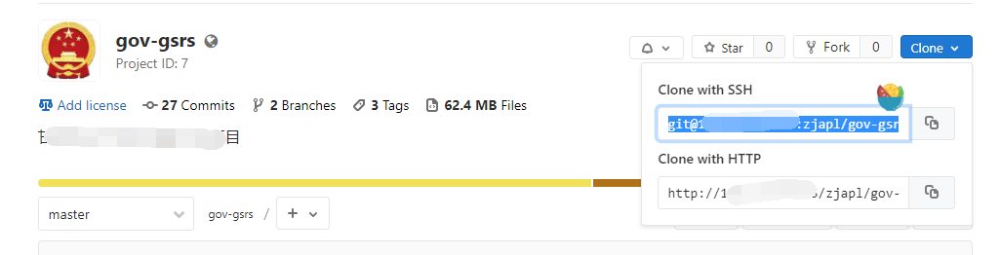

# 项目开发中使用Git

项目开发中如何使用git? 

开发人员只需要在dev分支进行代码更新和提交就能满足日常工作需要.

## 拉取项目

1. 复制项目的地址



2.创建一个文件夹,右键菜单中打开Git Bash命令行,如果没有安装Git,先安装Git工具.

```bash
git clone git@192.168.10.45:zjapl/gov-gsrs.git
```

3.进入项目目录 `gov-gsrs`


## 进行开发

### 切换到开发分支

```bash
git checkout dev
```

### 更新代码

```bash
git pull origin dev
```

### 提交代码

```bash
git push origin dev
```

