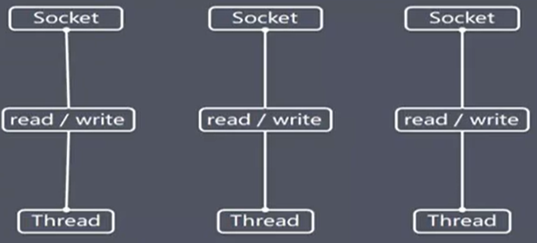

# BIO

**Blocking I/O**

* 传统的 Java I/O 编程. 相关的类和接口在 java.io 包
* 同步阻塞, 一个连接一个线程. 造成不必要的线程开销, 可通过**线程池机制改善**  
* 适用于连接数目小, 且固定的架构.对服务器资源要求高. jdk1.4 以前唯一选择.

**工程原理图**



**BIO 编程简单流程**

1. 服务端启动一个 `ServerSocket`
2. 客户端启动 `Socket`与服务器进行通信.

```java
package com.yangb.netty;


import java.io.IOException;
import java.io.InputStream;
import java.net.ServerSocket;
import java.net.Socket;
import java.util.concurrent.ExecutorService;
import java.util.concurrent.Executors;

/**
 * Created by yangb on 2020/5/8
 * Copyright (c) 2020 杨斌 All rights reserved.
 */
public class BioServer {

    public static void main(String[] args) throws IOException {

        // 创建一个线程池
        ExecutorService threadPool = Executors.newCachedThreadPool();

        // 创建ServerSocket
        ServerSocket serverSocket = new ServerSocket(6666);
        System.out.println("[服务已启动]");
        while (true) {
            // 监听等待客户端连接
            final Socket socket = serverSocket.accept();
            System.out.println("[客户端接入]");
            // 创建一个线程, 处理连接
            threadPool.execute(() -> {
                BioServer.handler(socket);
            });
        }

    }

    // 和客户端进行通讯
    public static void handler(Socket socket) {
        // 获取输入流
        try (InputStream inputStream = socket.getInputStream()) {
            byte[] bytes = new byte[1024];
            // 读取客户端数据
            while (true) {
                System.out.println("[线程信息: ID=" + Thread.currentThread().getId() + " NAME="+ Thread.currentThread().getName() +"]");
                int read = inputStream.read(bytes);
                if (read != -1) {
                    System.out.println(new String(bytes,0,read));
                } else {
                    break;
                }
            }

        } catch (IOException e) {
            e.printStackTrace();
        }finally {
            try {
                socket.close();
            } catch (IOException e) {
                e.printStackTrace();
            }
        }
    }
}

```

客户端连接服务器

```sh
telnet 127.0.0.1 6666
```

`ctrl+]`快捷键, `send hello word` 服务端收到消息.

**问题分析**

1. 每个请求都需要创建独立的线程. 
2. 当并发数较大时, 需要创建大量的线程来处理连接, 系统占用资源较大.
3. 连接建立后, 如果当前的线程暂时没有数据可读, 则线程就阻塞在`Read`操作上