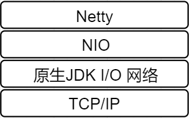

# Netty

推荐书籍: Netty In Action

## 简介

* Java 的开源框架
* 异步的，基于事件的网络应用框架。
* 针对 TCP 协议下,面向 Clients 的高并发应用.
* 在 NIO 的基础之上.

### Netty 的位置

### 应用场景

* 互联网行业: 分布式系统中,Netty 作为异步高性能通信框架. 往往作为基础通信组件被这些RPC框架使用
* 游戏行业:  网游的服务端
* 大数据领域: Hadoop 的 Avro 的 RPC 框架. 

## I/O模型

java支持的三种网络编程模型: BIO, NIO, AIO

* BIO: **同步并阻塞** (传统阻塞型) 一个连接一个线程.  *适用于连接数目小, 且固定的架构.*
* NIO: **同步非阻塞** 一个线程处理多个连接. *连接数目多且连接比较短的架构.* 
* AIO: **异步非阻塞**, (NIO2) JDK1.7 引入, 没有得到广泛的应用. 和操作系统有密切的关系, *连接数目多且连接比较长.*

## Reactor 模式

对应的叫法1. 反应器模式 2. 分发者模式（Dispatcher） 3. 通知者模式（notifier）

