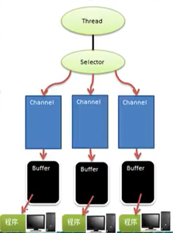
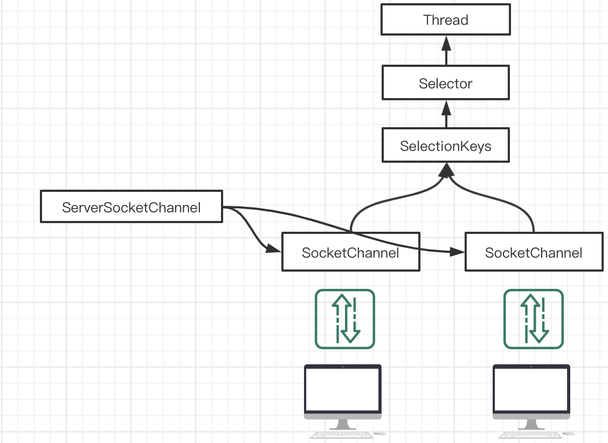
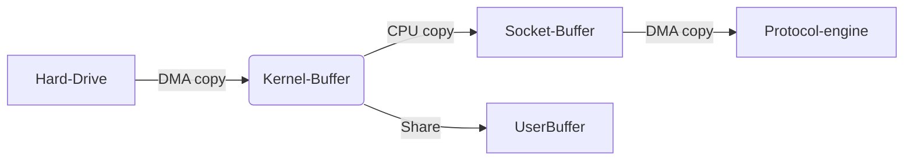

# NIO

## 简介

* 全称 Non-blocking I/O, jdk1.4 开始提供, **同步非阻塞**
* NIO 相关类 `java.nio` 包下.
* 三大核心: Channel(通道), Buffer(缓冲区), Selector(选择器)

**NIO 三大核心原理示意图**



1. 每个 Channel 都会对应一个 Buffer
2. Selector 对应一个线程,一个线程对应多个 Channel
3. 该图反应了有三个 Channel 注册到该 Selector
4. 程序切换到Channel是由事件( Event )决定的
5. Selector 跟进不同的事件, 在各个通道切换
6. Buffer 是一个内存块, 底层是数组
7. 数据通过 Buffer 读取和写入. (和BIO区别: BIO的流是单向的, NIO中的Buffer是可读可写的, 使用flip切换)
8. Channel 是双向的, 可以返回底层操作系统的情况.

**Buffer 的使用案例**

```java
public static void main(String[] args) {
    // 创建buffer
    IntBuffer buffer = IntBuffer.allocate(5);
    // 存放数据
    range(0,buffer.capacity()).forEach(i -> buffer.put(i*2));
    // 取数据
    buffer.flip(); // 将buffer转换, 读写切换!
    while (buffer.hasRemaining()) {
        System.out.println(buffer.get());
    }
}
```

## 缓冲区(Buffer)

本质是一个可以读写数据的内存块, 可以理解成一个含数组的容器对象.

**常用子类**

* **ByteBuffer**
* ShortBuffer
* CharBuffer
* IntBuffer
* LongBuffer
* DoubleBuffer
* FloatBuffer

**缓冲区的属性**

| 属性     | 描述                                            |
| -------- | ----------------------------------------------- |
| capacity | 容量                                            |
| limit    | 缓冲区设置的读写极限位置, 最大不能大于 capacity |
| position | 位置,  下一次操作位置                           |
| mark     | 标记                                            |

**常用方法**

... 

## 通道(Channel)

* BIO 中 stream 是单向的, Channel 是双向的.
* Channel 在 NIO 中是一个接口 `public interface Channel extends Closeable`
* 常用的 Channel 类有: 
  * `FileChannel` 文件数据读写
  * `DatagramChannel` UDP 数据读写
  * `ServerSocketChannel` 和 `SocketChannel` TCP 数据读写


**案例1**

通过Channel 将数据写入文件

```java
public static void main(String[] args) throws IOException {
    String str = "Hello, 杨斌";
    // 创建输出流
    FileOutputStream fileOutputStream = new 
        FileOutputStream("C:/Users/DELL/Documents/mydoc/netty/bio/test.txt");
    // 获取 Channel
    FileChannel fileChannel = fileOutputStream.getChannel();
    // 创建缓冲区
    ByteBuffer byteBuffer = ByteBuffer.allocate(1024);
    // 将 str 放入到 byteBuffer
    byteBuffer.put(str.getBytes());
    // 翻转 byteBuffer
    byteBuffer.flip();
    // 把 buffer 数据写入到通道 fileChannel
    fileChannel.write(byteBuffer);

    fileOutputStream.close();
}
```

**案列2**

读取文件内容

```java
public static void main(String[] args) throws IOException {
    // 创建输出流
    FileInputStream fileIn = new 
        FileInputStream("C:/Users/DELL/Documents/mydoc/netty/bio/test.txt");
    // 获取 Channel
    FileChannel fileChannel = fileIn.getChannel();
    // 创建字节缓冲器
    ByteBuffer buffer = ByteBuffer.allocate(1024);
    // 将通道数据读入到 buffer 中
    fileChannel.read(buffer);
    // 翻转 buffer
    buffer.flip();
    // 获取字节数组
    byte[] array = buffer.array();

    System.out.println(new String(array,0,buffer.limit()));

    fileIn.close();
}
```

* `transferFrom` 从目标通道复制数据到当前通道
* `transferTo` 把数据从当前通道复制到目标通道 

**FileChannel 文件拷贝**

```java
FileInputStream inputStream = new FileInputStream("/Users/mxj/xj.jpg");
FileOutputStream outputStream = new FileOutputStream("/Users/mxj/xj_copy.jpg");

FileChannel inputChannel = inputStream.getChannel();
FileChannel outputChannel = outputStream.getChannel();
outputChannel.transferFrom(inputChannel,0, inputChannel.size());

// 关闭流

```

**Buffer 数据类型化**

放什么类型,取什么类型, 否则有可能数据错误或者 BufferUnderflowException

```java
ByteBuffer buffer = ByteBuffer.allocate(64);
// 类型化放入数据
buffer.putInt(1);
buffer.putChar('a');
buffer.putDouble(1.1);
// 类型化取出数据
buffer.getInt();
```

**只读 Buffer**

获取只读 Buffer, 如果对此 Buffer 进行 put 操作,抛出 ReadOnlyBufferException 异常

```java
ByteBuffer byteBuffer = buffer.asReadOnlyBuffer();
```

**MappedByteBuffer**

可以让文件直接在内存(堆外内存)中修改, 操作系统不需要拷贝一次.

```java
RandomAccessFile raf = new RandomAccessFile("/Users/mxj/Documents/soft/study/netty/a.txt", "rw");
FileChannel channel = raf.getChannel();
// 参数一: 读写模式 参数二: 操作的开始位置 参数三: 结束位置
MappedByteBuffer mappedByteBuffer = channel.map(FileChannel.MapMode.READ_WRITE, 0, 4);
mappedByteBuffer.put(1, (byte) 'N');
channel.close();
raf.close();
```

**Scattering 和 Gathering**

Buffer 的聚合和分散

* Scattering: 将数据写入到Buffer时, 可以采用 Buffer 数组, 依次写入.
* Gathering: 从Buffer读取数据时, 可以采用 Buffer 数组,依次读取.


## 选择器 (Selector)

* NIO 用一个线程处理多个客户端连接, 就会使用到 Selector 选择器
* Selector 能够检测到多个注册通道上是否有事件发生, 如果有事件发生, 便针对事件进行相应处理. 这样就可以管理多个通道,意味着处理多个连接.
* 不用维护多个线程, 避免了多线程上下文切换导致的开销.

**常用方法说明**

* Selector open( ):  得到一个选择器对象
* int select(): 阻塞方法, 如果Selector中所有的通道都没有发生事件, 会阻塞.
* int select(long timeout): 如果在指定时间没有事件发生, 则返回
* int selectNow(): 立即返回 
* Set\<SelectedKey> selectedKeys(): 从内部集合中得到所有的selectedKey
* wakeup(): 唤醒 selector

**SelectionKey**

* 和 Channel 关联
* 对应事件类型

> ServerSockerChannel 类似于 ServerSocket
>
> SocketChannel 类似于 Socket

**原理图**



1. 当客户端连接时会通过 ServerSocketChannel 得到 SocketChannel
2. 将 SocketChannel 注册到 Selector 上 `register(Selector sel, int ops)`.一个Selector可以注册多个Channel 
3. 注册后会返回一个 SelectiongKey 关联到该 Selector [集合] 
4. Selector 进行监听(`select()` 方法), 返回有事件发生的 Channel 数量
5. 得到有事件发生的各个SelectionKey
6. 通过selectionKey获取SocketChannel(`Channel()`方法)
7. 使用Channel完成业务.


## NIO 非阻塞网络编程

服务端

```java

import java.io.IOException;
import java.net.InetSocketAddress;
import java.nio.ByteBuffer;
import java.nio.channels.SelectionKey;
import java.nio.channels.Selector;
import java.nio.channels.ServerSocketChannel;
import java.nio.channels.SocketChannel;
import java.util.Iterator;
import java.util.Set;

/**
 * NIO 网络编程 - 服务端
 * Created by YangBin on 2020/5/11
 * Copyright (c) 2020 杨斌 All rights reserved.
 */
public class NioServer {

    public static void main(String[] args) throws IOException {
        // 1. 创建 ServerSocketChannel
        ServerSocketChannel serverSocketChannel = ServerSocketChannel.open();

        // 2. 得到 Selector 对象
        Selector selector = Selector.open();

        // 3. 绑定端口 6666
        serverSocketChannel.socket().bind(new InetSocketAddress(6666));

        // 4. 设置为非阻塞模式
        serverSocketChannel.configureBlocking(false);

        // 5. 把 ServerSocketChannel 注册到 Selector, 关心 OP_ACCEPT(连接) 事件
        serverSocketChannel.register(selector, SelectionKey.OP_ACCEPT);

        // 6. 处理客户端连接
        while (true) {
            // 6.1 等待1秒, 没有事件发生, 返回
            if (selector.select(1000) == 0) {
                System.out.println("[服务器等待了1秒钟, 无连接]");
                continue;
            }

            // 6.2 如果事件的数量大于0, 表示已发生关注的事件, 获取相关事件的 selectionKey 集合
            Set<SelectionKey> selectionKeys = selector.selectedKeys();

            // 6.3 获取事件迭代器
            Iterator<SelectionKey> keyIterator = selectionKeys.iterator();

            while (keyIterator.hasNext()) {
                // 6.4 获取 selectionKey
                SelectionKey selectionKey = keyIterator.next();

                // 6.5根据 key 的事件,做出相应的处理

                // 6.5.1 判断事件为 OP_ACCEPT(连接事件), 表示有客户端连接
                if (selectionKey.isAcceptable()) {
                    // 6.5.1.1 与客户端建立连接,得到 SocketChannel
                    SocketChannel socketChannel = serverSocketChannel.accept();
                    System.out.println("[客户端连接成功] " + socketChannel.hashCode());

                    // 6,5.1.2 设置 socketChannel 为非阻塞模式
                    socketChannel.configureBlocking(false);

                    // 6.5.1.3 将 SocketChannel 注册到 Selector, 关注 OP_READ(读取) 事件, 同时关联一个 Buffer
                    socketChannel.register(selector, SelectionKey.OP_READ, ByteBuffer.allocate(1024));
                }

                // 6.5.2 判断事件如果为读取事件 OP_READ
                if (selectionKey.isReadable()) {
                    // 6.5.2.1 获取对应 Channel
                    SocketChannel channel = (SocketChannel) selectionKey.channel();
                    // 6.5.2.2 获取该 Channel 关联的 Buffer
                    ByteBuffer buffer = (ByteBuffer) selectionKey.attachment();
                    // 6.5.2.3 将 Channel 数据读取到 Buffer
                    channel.read(buffer);
                    buffer.flip();
                    // 6.5.2.4 输出获取到的结果
                    System.out.println("[客户端消息] " + new String(buffer.array(),0, buffer.limit()));
                    // 6.5.2.5 重置 Buffer
                    buffer.clear();
                }

                // 6.6 手动移除已操作的selectorKey, 防止重复操作
                keyIterator.remove();
            }
        }
    }
}
```

客户端:

```java
import java.io.IOException;
import java.net.InetSocketAddress;
import java.nio.ByteBuffer;
import java.nio.channels.SocketChannel;

/**
 * NIO 网络编程 - 客户端
 * Created by YangBin on 2020/5/11
 * Copyright (c) 2020 杨斌 All rights reserved.
 */
public class NioClient {

    public static void main(String[] args) throws IOException {

        // 1. 得到一个网络通道
        SocketChannel socketChannel = SocketChannel.open();

        // 2. 设置非阻塞
        socketChannel.configureBlocking(false);

        // 3. 提供服务端 ip 和端口
        InetSocketAddress inetSocketAddress = new InetSocketAddress("127.0.0.1", 6666);

        // 4. 连接服务器
        if (!socketChannel.connect(inetSocketAddress)) {
            // 4.1 如果连接未完成, 先做其他的事情
            while (!socketChannel.finishConnect()) {
                System.out.println("[因为连接需要时间, 客户端不会阻塞, 做其他的事情!]");
            }

            //4.2 连接成功, 发送数据
            String msg = "在吗?";
            ByteBuffer buffer = ByteBuffer.wrap(msg.getBytes());
            socketChannel.write(buffer);

            System.in.read();
        }
    }
}

```

## SelectionKey

**API**

* selectedKeys() 有事件发生的 selectedKey
* keys() 所有的selectedKey
* channel() 得到与之相关的通道
* attachment() 得到与之关联的共享数据
* interestOps(int ops) 设置或改变监听的事件
* isAcceptable() //是否可以 ACCEPT
* isReadable() // 是否可读
* isWritable() // 是否可写

## ServerSocketChannel

**API**

open() 

## NIO 零拷贝原理

零拷是从操作系统角度, 没有CPU拷贝

DMA copy: direct memory access 直接内存拷贝, 没有cpu参与

**传统的IO读写**  

4次拷贝, 3次状态切换


**mmap优化**





3次拷贝,3次状态切换

通过内存映射, 将文件映射到内核缓冲区, 同时用户空间可以**共享内核空间的数据**. 这样,在进行网络传输时可以减少内核空间到用户空间的拷贝次数.

**sendFile优化**

Linux2.1 提供了sendFile函数, 原理如下: 数据根本不用经过用户态, 直接从内核缓冲区进入到SocketBuffer, 同时由于和用户态完全无关, 就减少了一次上下文切换.

linux2.4 避免了从内核缓冲区拷贝到SocketBuffer. 


**代码实现**

```java
/**
 * Created by YangBin on 2020/5/15
 * Copyright (c) 2020 杨斌 All rights reserved.
 */
public class NewIoClient {

    public static void main(String[] args) throws IOException {
        SocketChannel socketChannel = SocketChannel.open();
        socketChannel.connect(new InetSocketAddress("localhost", 7001));
        String filename = "";
        FileChannel fileChannel = new FileInputStream(filename).getChannel();

        //记录发送时间
        long startTime = System.currentTimeMillis();

        // linux 调用transferTo方法就可以完成传输
        // windows 调用transferTo 一次只能传输8M, 因此需要分段传输
        long transferCount = fileChannel.transferTo(0, fileChannel.size(), socketChannel);

        System.out.println("发送的字节数 = " + transferCount + "耗时:" + (System.currentTimeMillis() - startTime));

    }
}
```

transferTo 方法

```java
/* <p> This method is potentially much more efficient than a simple loop
* that reads from this channel and writes to the target channel.  Many
* operating systems can transfer bytes directly from the filesystem cache
* to the target channel without actually copying them.  </p>
*/
public abstract long transferTo(long position, long count,
                                    WritableByteChannel target)
        throws IOException;
```


## AIO

JDK7 引入, I/O 编程常用的两种模式: Reactor 和 Proactor(主动器) NIO属于Reactor, 事件触发, 服务端得到通知,进行响应.

API 也称为 NIO2.0, 叫做异步不阻塞IO, AIO引入异步通道的概念, 采用Proactor模式, 简化程序编写, 有效的请求才会去启动线程. 特点是先由操作系统完成后才通知服务端程序启动线程处理, 一般适用于连接数多且连接时间长的应用.

目前AIO没有被广泛应用.

