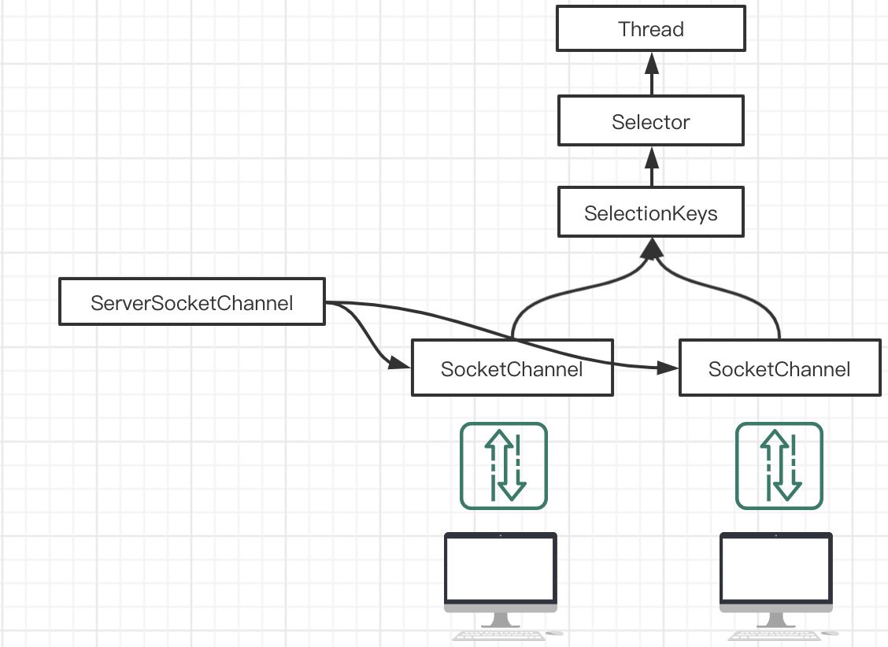

* `transferFrom` 从目标通道复制数据到当前通道
* `transferTo` 把数据从当前通道复制到目标通道 

**FileChannel 文件拷贝**

```java
FileInputStream inputStream = new FileInputStream("/Users/mxj/xj.jpg");
FileOutputStream outputStream = new FileOutputStream("/Users/mxj/xj_copy.jpg");

FileChannel inputChannel = inputStream.getChannel();
FileChannel outputChannel = outputStream.getChannel();
outputChannel.transferFrom(inputChannel,0, inputChannel.size());

// 关闭流

```

**Buffer 数据类型化**

放什么类型,取什么类型, 否则有可能数据错误或者 BufferUnderflowException

```java
ByteBuffer buffer = ByteBuffer.allocate(64);
// 类型化放入数据
buffer.putInt(1);
buffer.putChar('a');
buffer.putDouble(1.1);
// 类型化取出数据
buffer.getInt();
```

**只读 Buffer**

获取只读 Buffer, 如果对此 Buffer 进行 put 操作,抛出 ReadOnlyBufferException 异常

```java
ByteBuffer byteBuffer = buffer.asReadOnlyBuffer();
```

**MappedByteBuffer**

可以让文件直接在内存(堆外内存)中修改, 操作系统不需要拷贝一次.

```java
RandomAccessFile raf = new RandomAccessFile("/Users/mxj/Documents/soft/study/netty/a.txt", "rw");
FileChannel channel = raf.getChannel();
// 参数一: 读写模式 参数二: 操作的开始位置 参数三: 结束位置
MappedByteBuffer mappedByteBuffer = channel.map(FileChannel.MapMode.READ_WRITE, 0, 4);
mappedByteBuffer.put(1, (byte) 'N');
channel.close();
raf.close();
```

**Scattering 和 Gathering**

Buffer 的聚合和分散

* Scattering: 将数据写入到Buffer时, 可以采用 Buffer 数组, 依次写入.
* Gathering: 从Buffer读取数据时, 可以采用 Buffer 数组,依次读取.


## 选择器 (Selector)

* NIO 用一个线程处理多个客户端连接, 就会使用到 Selector 选择器
* Selector 能够检测到多个注册通道上是否有事件发生, 如果有事件发生, 便针对事件进行相应处理. 这样就可以管理多个通道,意味着处理多个连接.
* 不用维护多个线程, 避免了多线程上下文切换导致的开销.

**常用方法说明**

* Selector open( ):  得到一个选择器对象
* int select(): 阻塞方法, 如果Selector中所有的通道都没有发生事件, 会阻塞.
* int select(long timeout): 如果在指定时间没有事件发生, 则返回
* int selectNow(): 立即返回 
* Set\<SelectedKey> selectedKeys(): 从内部集合中得到所有的selectedKey
* wakeup(): 唤醒 selector

**SelectionKey**

* 和 Channel 关联
* 对应事件类型

> ServerSockerChannel 类似于 ServerSocket
>
> SocketChannel 类似于 Socket

**原理图**



1. 当客户端连接时会通过 ServerSocketChannel 得到 SocketChannel
2. 将 SocketChannel 注册到 Selector 上 `register(Selector sel, int ops)`.一个Selector可以注册多个Channel 
3. 注册后会返回一个 SelectiongKey 关联到该 Selector [集合] 
4. Selector 进行监听(`select()` 方法), 返回有事件发生的 Channel 数量
5. 得到有事件发生的各个SelectionKey
6. 通过selectionKey获取SocketChannel(`Channel()`方法)
7. 使用Channel完成业务.

