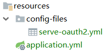

# 配置中心

## Spring Cloud Config 

配置服务器为各个不同的微服务应用的所有环境提供了一个中心化的外部配置.

### 本地配置

**(1) 创建配置服务模块**

创建 seve-config 项目

pom.xml

```xml
<!--配置服务-->
<dependency>
    <groupId>org.springframework.cloud</groupId>
    <artifactId>spring-cloud-config-server</artifactId>
</dependency>
```

application.yml

```yml
server:
  port: 35002

spring:
  application:
    name: serve-config
  cloud:
    config:
      server:
        native:
          search-locations:
            - 'classpath:/config-files'
  profiles:
    active:
      - native
```

配置文件保存在 resource/config-files 目录下 



**(2) 创建serve-oauth2客户端项目**

pom.xml

```xml
<!--配置中心-->
<dependency>
    <groupId>org.springframework.cloud</groupId>
    <artifactId>spring-cloud-starter-config</artifactId>
</dependency>
```

bootstrap.yml

```yml
spring:
  application:
    name: serve-oauth2
  cloud:
    config:
      uri:
        - http://serve-config:35002 # 配置服务地址
      fail-fast: true   # 如果没有读取成功，则执行快速失败(fail-fast)
```

这里我们为什么使用的是 bootstrap.yml，而不是 application.yml 文件，因为 bootstrap.yml 文件相对于application.yml 具有优先的执行顺序。这里我们指定了程序名为config-client.并且向Url地址为http://serve-config:35002 的 Config Server 读取配置文件。如果没有读取成功，则执行快速失败(fail-fast)。那么这个客户端是如何找到 Config Server 服务端给它提供的指定 的配置文件的呢？这个主要是默认拼接 bootstrap.yml 中的两个属性变量：${spring.application.name},  ${spring.profiles.active}，两者以“-”相连,这样就构成了Config Server中读取的文件名了.

bootstrap.yml 优先级高于 application.yml, 他们可以同时存在.

