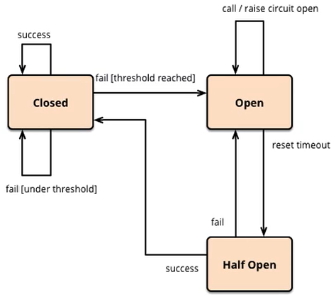

# 服务降级/熔断/限流

## 概念解释

### 服务雪崩

* "扇出效应":  服务A -> 服务B, 服务C; B和C又调用其他微服务. 

* "雪崩效应": 如果链路上某个服务调用的时间过长或者不可用, 对服务A的调用就会占用越来越多的系统资源.进而服务崩溃.

### 服务熔断/服务隔离 (Fallback)

顾名思义，它是指将系统按照一定的原则划分为若干个服务模块，各个模块之间相对独立，无强依赖。当有故障发生时，能将问题和影响隔离在某个模块内部，而不扩散风险，不波及其它模块，不影响整体的系统服务。

分布式系统中,许多依赖不可避免的会调用失败, Hystrix能保证在一个依赖出问题的情况下, 不会导致整体服务失败,避免级联故障,提高分布式系统弹性.

"断路器" 本身是一种开关装置, 某个服务单元发生故障时,向调用方返回一个预期的.可处理的备选响应(fullback) 这样就可以保证服务调用方的线程不会被长时间占用

### 服务降级 (Break)

什么是服务降级？当服务器压力剧增的情况下，根据实际业务情况及流量，对一些服务和页面有策略的不处理或换种简单的方式处理，从而释放服务器资源以保证核心交易正常运作或高效运作。

### 服务限流 (Flowlimit)

限流可以认为服务降级的一种，限流就是限制系统的输入和输出流量已达到保护系统的目的。一般来说系统的吞吐量是可以被测算的，为了保证系统的稳定运行，一旦达到的需要限制的阈值，就需要限制流量并采取一些措施以完成限制流量的目的。比如：延迟处理，拒绝处理，或者部分拒绝处理等等。

## Hystrix

### 项目构建

pom.xml

```xml
<!--服务熔断&降级-->
<dependency>
    <groupId>org.springframework.cloud</groupId>
    <artifactId>spring-cloud-starter-hystrix</artifactId>
</dependency>
```

启动类添加`@EnableCircuitBreaker` 启用断路器注解

```java
@SpringBootApplication
@EnableCircuitBreaker
public class PaymentServer {
    public static void main(String[] args) {
        SpringApplication.run(PaymentServer.class, args);
    }
}
```

### 降级处理

服务异常或者超时,都将执行timeoutHandler中的方法.

```java
@Override
@HystrixCommand(fallbackMethod = "timeoutHandler",commandProperties = {
    @HystrixProperty(name = "execution.isolation.thread.timeoutInMilliseconds", value = "5000")})
public String errrMethod(Integer id){
    try {
        TimeUnit.SECONDS.sleep(5);
    } catch (InterruptedException e) {
        e.printStackTrace();
    }
    return "服务超时演示!";
}

public String timeoutHandler(Integer id){
    return "服务超时" + id;
}
```

### 全局服务降级

添加全局`@DefaultProperties`服务降级属性

```java
@Service
@DefaultProperties(defaultFallback = "globalFallbackMethod")
public class PaymentServiceImpl implements PaymentService {
    
    @HystrixCommand
    public String errrMethod(Integer id){
        int x = 1/0;
        try {
            TimeUnit.SECONDS.sleep(8);
        } catch (InterruptedException e) {
            e.printStackTrace();
        }
        return "服务演示!";
    }
    
    public String globalFallbackMethod(){
        return "调用异常,这是全局降级方案!";
    }
}
```

### 哪些情况会导致降级

1. 程序运行异常
2. 超时
3. 服务熔断处罚降级
4. 线程池/信号量 打满也会导致服务降级

### 熔断机制

当扇出链路的某个微服务出错不可用或者响应时间太长时, 进而熔断该节点的微服务调用,快速返回错误信息. **当检测到该节点微服务调用响应正常后,恢复调用链路.**

熔断注解`@HystrixCommand`



半开效果, 断路器打开时,会尝试调用远程服务,如果远程服务可用, 断路器会自动关闭.

`HystrixCommandProperties.class` 包含了熔断的默认配置属性.

**隔离策略**

THREAD 线程池隔离, SEMAPHORE 信号池隔离, 如果采用线程池隔离,令牌中继的时候获取登录的Authorization为空, 所以无法进行令牌传递.

```yml
hystrix:
  command:
    default: #default全局有效，service id指定应用有效
      execution:
        isolation:
          strategy: SEMAPHORE # 隔离策略: THREAD 线程池隔离, SEMAPHORE 信号池隔离, 如果采用线程池隔离,令牌中继的时候无法获取Authorization
          thread:
            timeoutInMilliseconds: 3000 #断路器超时时间，默认1000ms
```


